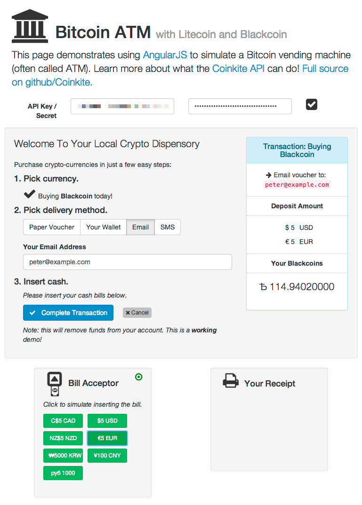
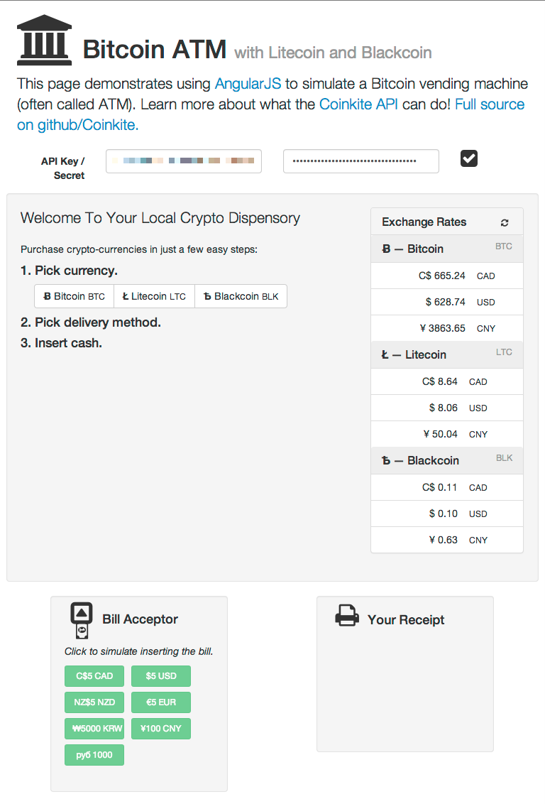

# Coinkite Bitcoin ATM Example in [AngularJS](https://angularjs.org/)

[Learn more about Coinkite's API here](https://docs.coinkite.com/)
and visit the [Coinkite Main Site](https://coinkite.com/) to open your
account today!

## Live Demo

[coinkite.github.io/coinkite-bitcoin-atm](http://coinkite.github.io/coinkite-bitcoin-atm/)
for a working live demo served by Github Pages.

## Operation

If you leave the API Key and secret blank, the system will support
Bitcoin, Litecoin and Blackcoin in a demo mode. You can do all parts
of the transaction, but no coins will be sent.

However, if you put in your API key (from <https://coinkite.com/merchant/api>)
then the list of coin-types
will be restricted to the types of subaccounts you have and are
allowed on that API key. It simply picks the first account of each
coin type from your account. It doesn't check balances or anything
fancy like that. The API key you use needs to have the 'read',
'send' and 'send2' permissions.

## Screenshots

### Buy Coins Example

### Idle Screen (rate table)

## Limitations

This code has some limitations, because it is only a demo:

- Does not consider the balance of the source accounts. It should
not start transactions if it doesn't have enough coins on-hand (at
Coinkite) to sell.

- Exchange rates shown are just Coinkite reference exchange rates,
and do not include a spread and should be pegged to a specific
exchange. (Aside: our Coinkite terminals do exactly that,
and support a spread different both for each fiat and also
each coin type).

- Does not handle the case where a customer has inserted cash but
the transaction doesn't complete. This is an important error case
that real code should be careful to deal with correctly.

- The receipt is not the best and should include more details.

- When deployed as an ATM, the API keys would be on the ATM itself,
which is unacceptable.  At a minimum, we would suggest encrypting
them with a password that the operator must provide on startup.

- Bitcoin (pubkey) address entry should always be via QR scanner, and
never by keyboard.

## Local Install

Use you favourite micro webserver to serve `index.html` from this directory.
You can do this easily with Python (which is probably already installed).

    python -m SimpleHTTPServer

... and then surf to <http://localhost:8000> using a modern browser.

When you get tired of cut-n-pasting your API key and secret, create a file
in this directory called `my-keys.json` and it will be used to prefill those
fields.

Example `my-keys.json` file:

    {
        "api_key": "K11aaa11a-aa11a111-a11aaa11111a1aa1",
        "api_secret": "Saa1a1aa1-11a11111-aa111aa1111aa111"
    }

## Requirements

We are using:

- AngularJS <https://docs.angularjs.org>
- Bootstrap <http://getbootstrap.com/>
- AngularStrap <http://mgcrea.github.io/angular-strap>
- Restangular <https://github.com/mgonto/restangular>
- lodash (required by Restangular) <http://lodash.com/>
- font-awesome <http://fontawesome.io/>
- crypto-js (just HMAC-SHA256) <https://code.google.com/p/crypto-js/>

All these files are being provided by CDN sources to make this package lighter.

## More about Coinkite

Coinkite is the world's easiest and most powerful web wallet for
safely holding all your cryptocurrencies, including Bitcoin and Litecoin.

[Learn more about all we offer](https://coinkite.com/)

